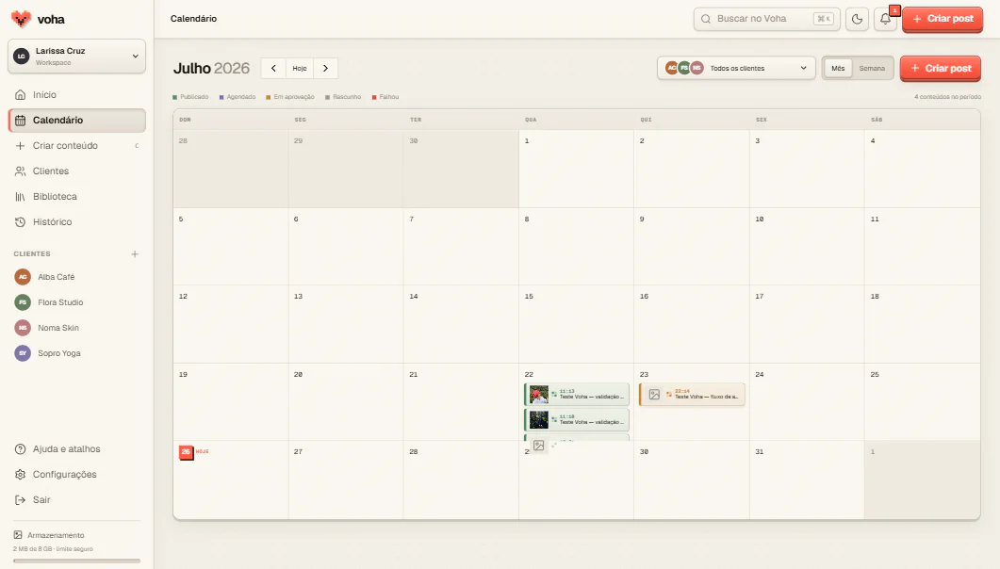
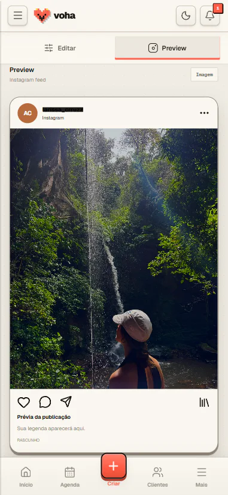
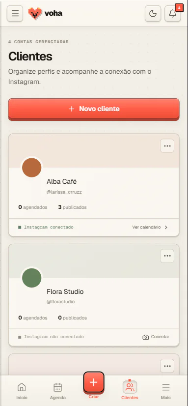
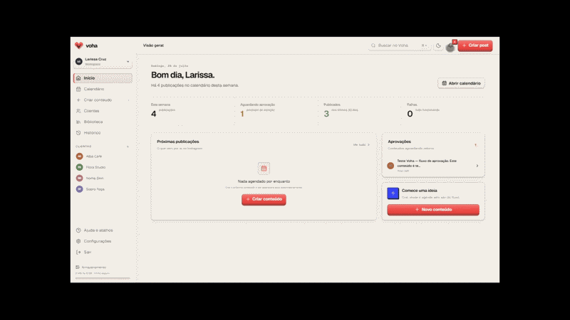

<pre align="center">
█   █  ███  █  █  ███
█   █ █   █ █  █ █   █
█   █ █   █ ████ █████
 █ █  █   █ █  █ █   █
  █    ███  █  █ █   █
</pre>

# 

Planejamento, aprovação, agendamento e publicação de conteúdo no Instagram em
uma interface mobile-first.

[Acessar o Voha](https://voha-lab.com.br) · [Arquitetura](docs/architecture.md) ·
[Operação](docs/operations.md) · [Segurança](docs/security-checklist.md)

> **Estágio atual:** MVP funcional em piloto controlado. Contas profissionais
> gerenciadas pela equipe são cadastradas manualmente no App Dashboard da Meta
> enquanto o Advanced Access não é concluído.

## Produto

O calendário é o centro do Voha. A social media organiza clientes, mídias,
aprovações e publicações sem alternar entre planilhas, pastas e lembretes.

- calendário mensal e semanal com os estados de cada publicação;
- criação de imagem, carrossel e Reel com preview inspirado no Instagram;
- biblioteca privada de mídias com imagens e vídeos;
- legenda, primeiro comentário e fluxo de aprovação por link;
- publicação imediata ou agendada;
- histórico de tentativas, falhas e retries;
- alertas no produto e por e-mail;
- conexão segura de contas profissionais pelo Instagram Login;
- interface responsiva, com modo claro e escuro.

## Interface

### Calendário



<table>
  <tr>
    <td width="50%">
      
    </td>
    <td width="50%">
      
    </td>
  </tr>
  <tr>
    <td align="center"><strong>Criar e visualizar</strong></td>
    <td align="center"><strong>Gerenciar clientes</strong></td>
  </tr>
</table>

### Demonstração



## Como funciona

```text
Social media
    │
    ▼
Next.js 16 no Cloudflare Workers
    ├── interface mobile-first e rotas de servidor
    ├── autenticação e dados ───────────────► Supabase
    ├── imagens, carrosséis e Reels ───────► Cloudflare R2
    └── OAuth e publicação ────────────────► Instagram API
```

Cada dado pertence a um workspace protegido por Row Level Security. Arquivos
ficam em um bucket privado e chegam ao navegador somente por URLs assinadas de
curta duração. Tokens do Instagram são criptografados com AES-256-GCM antes de
serem persistidos.

## Stack

| Camada | Tecnologia |
| --- | --- |
| Aplicação | Next.js 16, React 19 e TypeScript |
| Runtime | Cloudflare Workers via OpenNext |
| Banco e autenticação | Supabase Auth e PostgreSQL com RLS |
| Mídias | Cloudflare R2 privado |
| Publicação | Instagram API with Instagram Login |
| E-mail | Cloudflare Email Service |

## Executar localmente

### Pré-requisitos

- Node.js 20.9 ou superior;
- projeto Supabase;
- bucket privado no Cloudflare R2;
- app configurado no Meta for Developers.

### Instalação

```bash
git clone https://github.com/Bielcx/voha-lab.git
cd voha-lab
npm install
copy .env.example .env.local
npx supabase db push
npm run dev
```

Acesse `http://localhost:3000`. Os fluxos autenticados dependem dos serviços e
variáveis configurados; segredos nunca devem ser enviados ao navegador ou
versionados.

## Variáveis de ambiente

O arquivo [.env.example](.env.example) contém a lista completa sem valores reais.

| Variável | Escopo |
| --- | --- |
| `NEXT_PUBLIC_APP_URL` | pública |
| `NEXT_PUBLIC_SUPPORT_EMAIL` | pública |
| `NEXT_PUBLIC_SUPABASE_URL` | pública |
| `NEXT_PUBLIC_SUPABASE_PUBLISHABLE_KEY` | pública |
| `SUPABASE_SECRET_KEY` | servidor |
| `R2_ACCOUNT_ID` | servidor |
| `R2_ACCESS_KEY_ID` | servidor |
| `R2_SECRET_ACCESS_KEY` | servidor |
| `R2_BUCKET_NAME` | servidor |
| `META_INSTAGRAM_APP_ID` | servidor |
| `META_INSTAGRAM_APP_SECRET` | servidor |
| `META_TOKEN_ENCRYPTION_KEY` | servidor |
| `VOHA_CRON_SECRET` | servidor |
| `ALERT_EMAIL_FROM` | servidor, opcional |

## Qualidade

```bash
npm test
npm run lint
npm run build
npm run build:cloudflare
```

O deploy de produção usa Cloudflare Workers Builds conectado ao GitHub.

## Roadmap

- validar o onboarding manual da primeira conta profissional gerenciada;
- concluir o checklist de hardening e lançamento do MVP;
- formalizar Business Verification e solicitar Advanced Access à Meta quando o
  onboarding manual deixar de atender à operação;
- ampliar métricas e insights somente quando houver uma necessidade real do
  fluxo de trabalho.

## Documentação

- [Arquitetura e modelo de dados](docs/architecture.md)
- [Deploy na Cloudflare](docs/cloudflare-deployment.md)
- [Operação, alertas e diagnóstico](docs/operations.md)
- [Instagram API e OAuth](docs/meta-instagram.md)
- [Preparação para o App Review](docs/meta-app-review.md)
- [Custos, limites e continuidade](docs/costs-and-limits.md)
- [Checklist de segurança](docs/security-checklist.md)
- [Runbook de lançamento e rollback](docs/launch-runbook.md)

## Privacidade

O Voha solicita apenas permissões necessárias ao fluxo implementado. Credenciais,
tokens, URLs assinadas e dados de clientes não devem aparecer em issues, logs,
screenshots ou commits.

- [Política de privacidade](https://voha-lab.com.br/privacidade)
- [Exclusão de dados](https://voha-lab.com.br/exclusao-de-dados)
